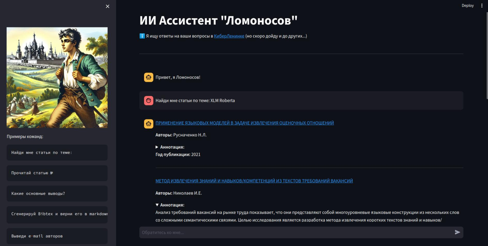
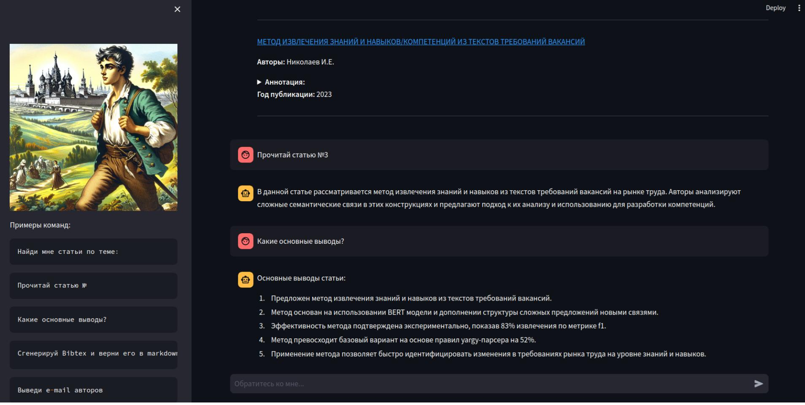
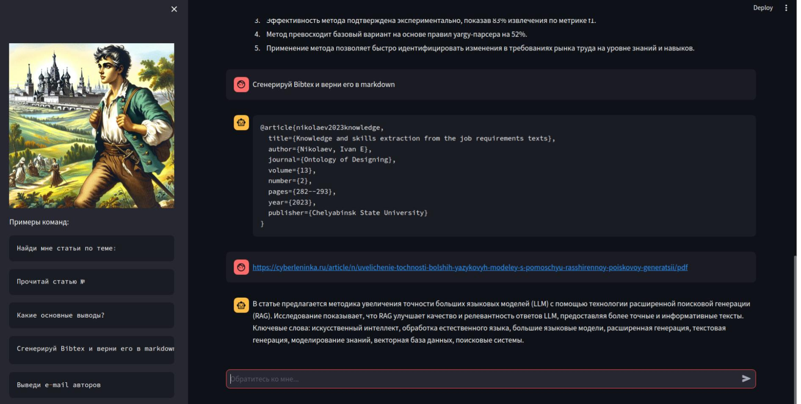

# ИИ Ассистент "Ломоносов"

_Современные поисковые системы для научной литературы остались в эпохе 00-х...Пора что-то менять!_

ИИ Ассистент "Ломоносов" это агент, работающий на основе GigaChat и GigaChain.
Он позволяет учёным, работающим с литературой, производить её поиск быстрее и эффективнее.

### Разработан в рамках [DeepHack Agents 2024](https://agents.deephack.me/)

## Use Cases

### Найди статью




Поиск статьи по заданной тематике или ключевым словам.

----

### Выводы по статье



Обобщение и извлечение основных выводов.

----

### Сгенерировать Bibtex entry



Генерация `bibtex` для цитирования, а также чтение и понимание статьи по внешней ссылке.

Чтение и понимание статьи по внешней ссылке

----

### И многое другое TO BE DONE...

## Архитектура решения


Движок ассистента разработан на основе GigaChain. В качестве LLM используется GigaChat, который обогащён инструментами (Tools) и инструкциями (Prompts) для взаимодействия с внешним миром.
 
### Структура проекта

```
├── app # основная директория проекта
│   ├── common # содержит tools.py
│   ├── __init__.py
├── docker-compose.yml
├── Dockerfile
├── lomonosov.py # стартовый файл проекта
├── README.md
├── requirements.txt
└── resources # ресурсы проекта
    ├── data_tmp
    ├── img
    ├── prompts
    └── tests
```

# How to run? Запуск решения

## Development

0. Install requirements

```
pip install -r requirements.txt
```

1. Create `.env` in the root dir

```
AUTH_DATA="GIGA_CHAT_API_KEY"
temperature=0.1
scope="GIGACHAT_API_CORP"
model="GigaChat-Pro-preview"
timeout=600
CYBERLENINKA_SIZE=30
TOP_K_PAPERS=3
```

2. Run with Python

```
python3.10 -m streamlit run lomonosov.py
```

## Production with Docker

1. Create `.env-prod` in the root dir

```
environment=production
AUTH_DATA="GIGA_CHAT_API_KEY"
temperature=0.1
scope="GIGACHAT_API_CORP"
model="GigaChat-Pro-preview"
timeout=600
CYBERLENINKA_SIZE=30
TOP_K_PAPERS=3
```

2. Run with docker-compose

```
docker-compose build
docker-compose up
```

3. Use it on port `8501` by default
